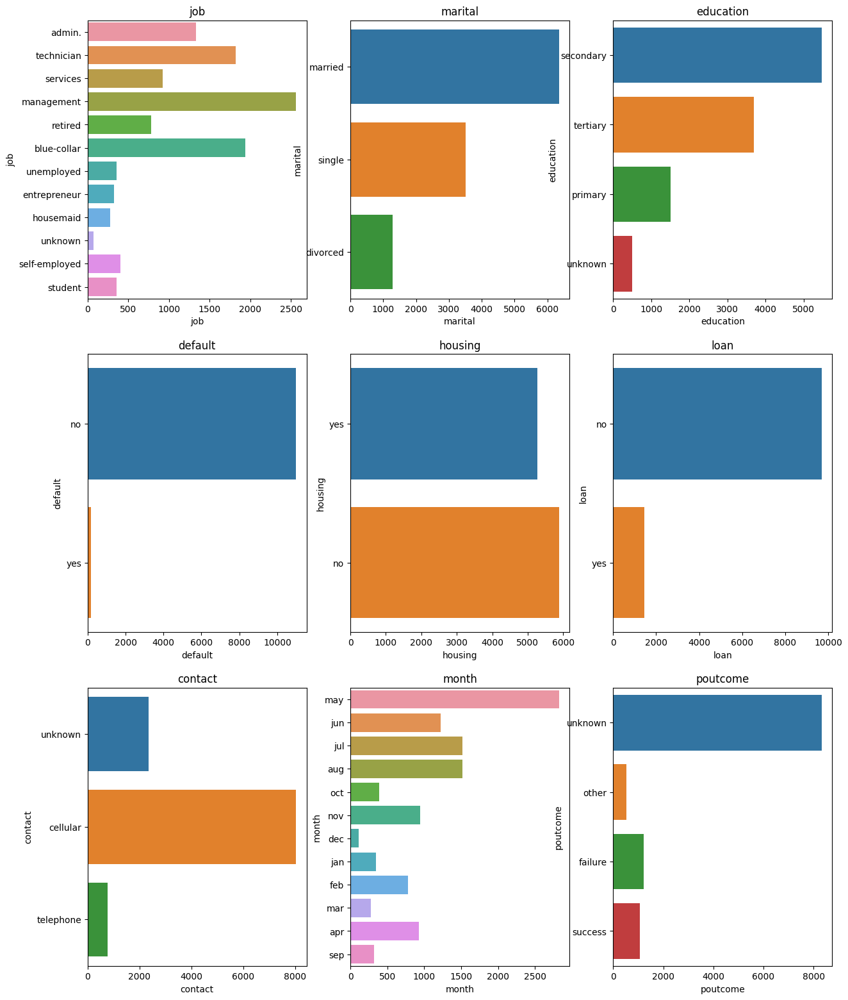
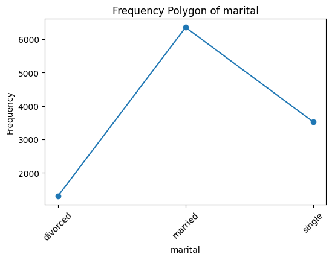
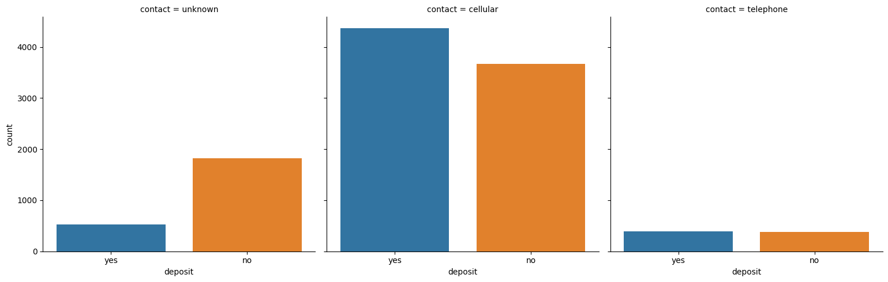
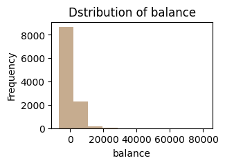
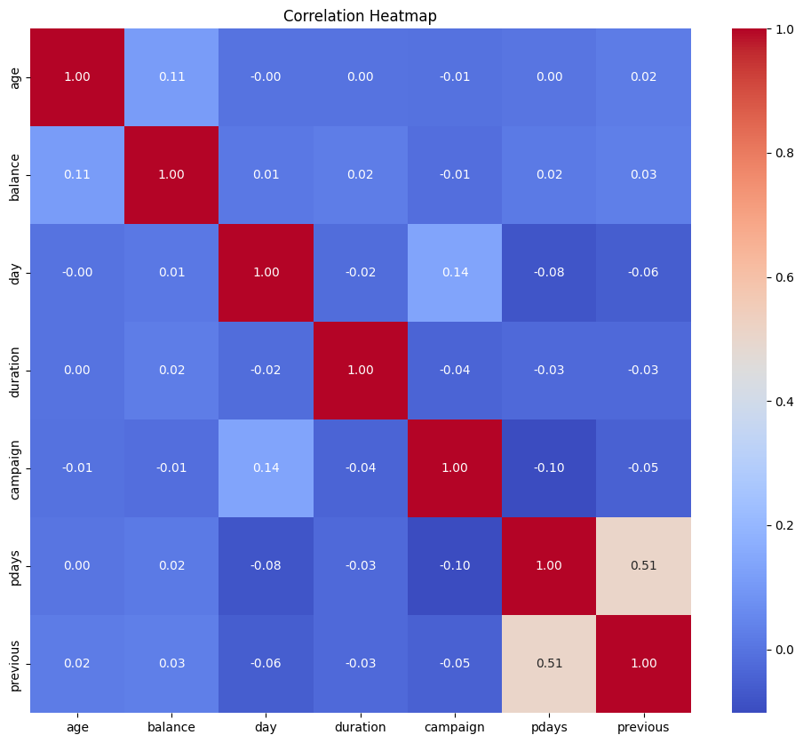
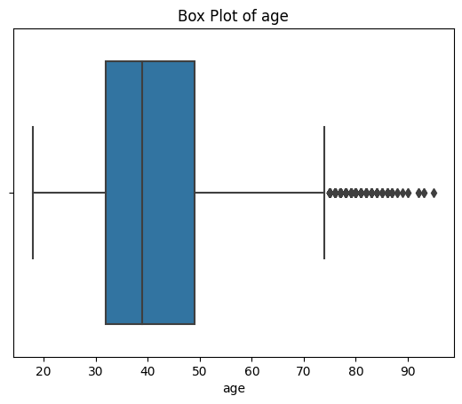
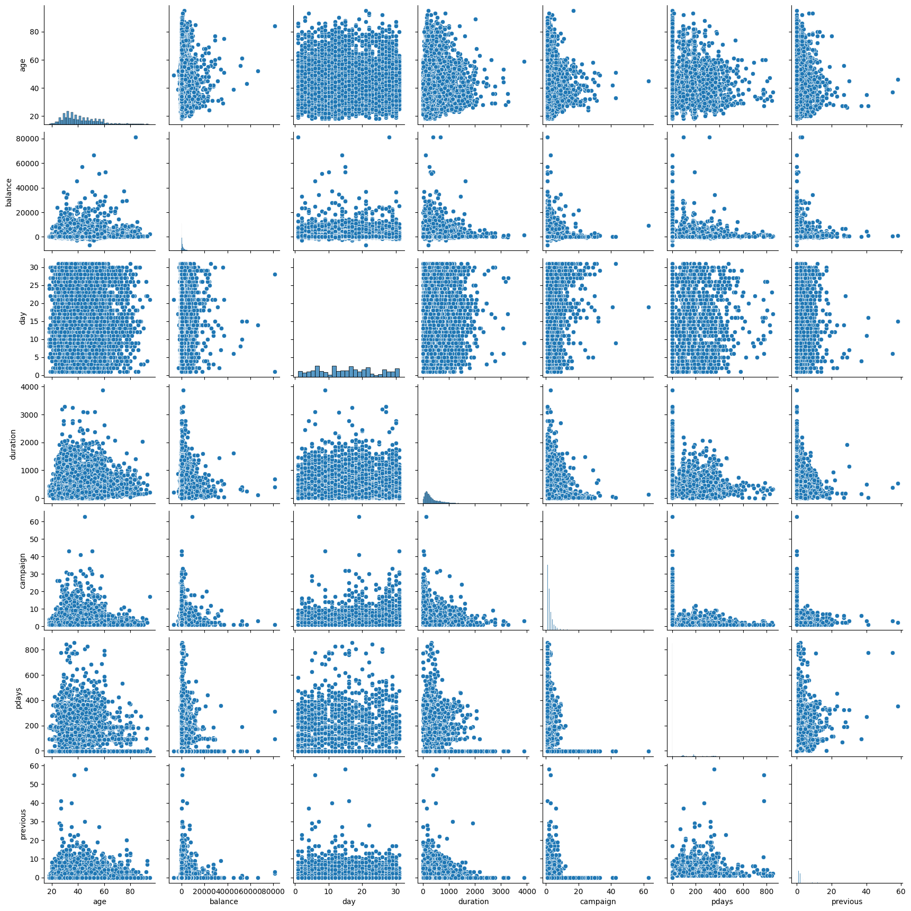

# Bank Marketing Data Visualization

<div align="left"><button><a href="https://colab.research.google.com/github/QuantEcon/workshop.africa-july2023/blob/main/day01/exercise_set_1.ipynb"></a></button></div>

## Introduction

This repository contains Python code for visualizing the Bank Marketing dataset using various data visualization techniques. The dataset is loaded from a CSV file, and both numerical and categorical features are explored using popular libraries such as Pandas, Matplotlib, Seaborn, and Plotly.

## Contents

1. [Overview](#overview)
2. [Setup](#setup)
3. [Description of dataset](#description-of-dataset)
4. [Visualizations](#visualizations)

## Overview

The Bank Marketing dataset is loaded and analyzed through various data visualization techniques. This includes visualizing the distribution of both categorical and numerical features, exploring relationships between features and labels, and performing multivariate analysis.

## Setup

1. Clone the repository:
    ```bash
    git clone https://github.com/ishika-mi/DataVisualization-Banking.git
    cd DataVisualization-Banking
2. Install the required libraries by running the following command:

   ```bash
   pip install pandas numpy matplotlib seaborn plotly
3. Run the Jupyter notebook or Python script to execute the visualizations.

## Description of dataset

1. age: Represents the age of the individual.
2. job: Describes the occupation or job of the person.
3. marital: Indicates the marital status of the person (e.g., married, single, divorced).
4. education: Represents the educational level of the person (e.g., primary, secondary, tertiary).
5. default: Indicates whether the person has credit in default ('yes', 'no', or 'unknown').
6. housing: Shows whether the person has a housing loan ('yes', 'no', or 'unknown').
7. loan: Indicates whether the person has a personal loan ('yes', 'no', or 'unknown').
8. contact: Describes the method of communication used to contact the person (e.g., 'cellular', 'telephone').
9. day: Indicates the day of the week of the last contact.
10. month: Represents the month of the last contact.
11. Duration: Represents the duration of the last contact in seconds
12. campaign: Indicates the number of contacts made during this campaign.
13. pdays: Describes the number of days since the person was last contacted or -1 if they were not previously contacted.
14. previous: Represents the number of contacts made before this campaign.
15. poutcome: Indicates the outcome of the previous marketing campaign.
16. deposit: The target variable, indicating whether the person subscribed to a term deposit ('yes' or 'no')gn.

## Visualizations
- **Categorical Feature Distributions:** 
Visualizes the distribution of categorical features using count plots and frequency polygons.
    - Example of Categorical Feature Distributions - **CountPlot**
        

- **Frequency Polygon:** 
Plots frequency polygons for each categorical feature to show the distribution of values.
    - Example of Frequency Polygon - **Frequency Polygon of Maritial**
        

- **Relationship between Categorical Features and Label:** 
Uses catplots to explore the relationship between categorical features and the label ('deposit').
    - Example of Relationship between Categorical Features and Label - **catplot(Unknown, Cellular, telephone)**
        

- **Numerical Feature Distributions:** 
Visualizes the distribution of numerical features using histograms, density plots, violin plots, bar graphs, box plots, and scatter plots.
    - Example of Numerical Feature Distributions - **Histogram(Distribution of balance)**
        

- **Heatmap:** 
Displays the correlation heatmap for numerical features.
    - Example of **Heatmap**
        

- **Box Plot:** 
Plots box and whisker plots for numerical features.
    - Example of **Box Plot (Box Plot of Age)**
        

- **Multivariate Analysis:** 
Includes scatter plots, parallel coordinate plots, and contour plots for multivariate analysis.
    - Example of Multivariate - **Scatter Plots**
        
